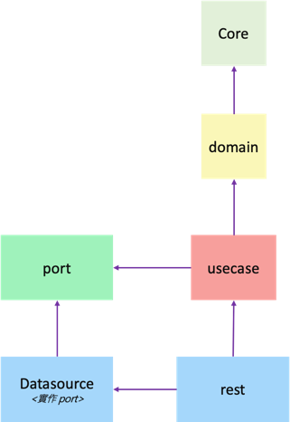

## Clean Architecture 簡單架構範例

### 使用框架
- Spring Boot
- Spring Data JPA
- H2 Database

### 如何啟動
執行 `adapter/rest/src/main/java/com/example/RestApplication.java` 即可啟動 
預設會啟動在 `http://localhost:9090/` 
啟動後可用 `http://localhost:9090/h2-console` 進入 H2 資料庫管理介面 

連線資訊如下: 
JDBC URL: `jdbc:h2:mem:testdb` 
User Name: `sa` 
Password: `password` 

### 測試
測試程式範例在 `usecase/src/test/java/com/example/test/NewOrderUseCaseTest.java`

### 模組依賴關係

